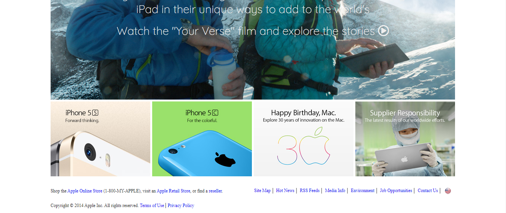

# OLD APPLE PAGE CLONE

> A clone of an old version of apple's page.

## Built With

- HTML,
- CSS

## Live Demo

[Live Demo Link](https://raw.githack.com/ElijahTobs/Old-Apple-Clone/main/index.html)

## Getting Started

**This is an example of how you may give instructions on setting up your project locally.**
**Modify this file to match your project, remove sections that don't apply. For example: delete the testing section if the currect project doesn't require testing.**

To get a local copy up and running follow these simple example steps

## Authors

👤 **Elijah Ayandokun**

- Github: [@ElijahTobs](https://github.com/ElijahTobs)
- Twitter: [@Elijahgr8](https://twitter.com/Elijahgr8)
- Linkedin: [linkedin](https://linkedin.com/in/ayandokunelijah)

## 🤝 Contributing

Contributions, issues and feature requests are welcome!

Feel free to check the [issues page](issues/).

## Show your support

Give a ⭐️ if you like this project!

## Acknowledgments

- Hat tip to anyone whose code was used
- Inspiration
- etc

## 📝 License

This project is [MIT](lic.url) licensed.
